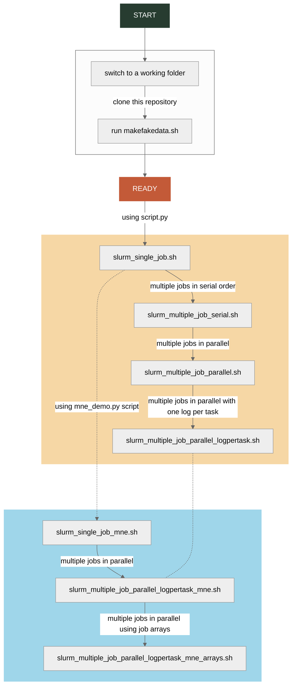

# SLURM Demo
Tutorial scripts for dispatching parallel jobs to SLURM cluster. Start with sending a single python script as one task on one CPU to the SLURM cluster, and then build up by first serializing and then parallelizing the job dispatch. Currently, the demo covers parallel dispatch using two ways: the crude approach of sending each task to the background (using `&`) and dispatching the next; and the other neater approach of using SLURM job arrays.

## Instructions

#### Essentials
- Things to change in each script:
   1. Fill in your email address, it is currently empty
   2. Use your `conda` environment and not mine (`harold`)
   3. If you are using a script other than the ones provided, make sure to indicate its path/name correctly
- Run each SLURM bash script on the command line by typing `sbatch <scriptname.sh>`. This will submit a job to the SLURM cluster.
- View the job status by running `squeue -u <your username>`. This will only run it once. If you want to monitor it constantly, use the `watch` command to do so: `watch -n1 "squeue -u <your username>"`, this will monitor your job at regular 1 sec intervals. To stop monitoring, press `Ctrl + C`.

#### Resources
- For details about configuration parameters in the header portion of SLURM bash script, see [official documentation for `sbatch`](https://slurm.schedmd.com/sbatch.html)
- For details about the function `srun` that dispatches each task, see [official documentation for `srun`](https://slurm.schedmd.com/srun.html)
- For details about how the filenames for the logfiles are inferred, see [this section of the `sbatch` documentation](https://slurm.schedmd.com/sbatch.html#SECTION_%3CB%3Efilename-pattern%3C/B%3E)
- For details about which environment variables are available when a job has been dispatched, see [this section of the `sbatch` documentation](https://slurm.schedmd.com/sbatch.html#SECTION_OUTPUT-ENVIRONMENT-VARIABLES)

## TODO
  1. Main log files accumulate in working directory (use --chdir, or manually cd to log dir?)
  2. Add dedicated Python logger instead of print statements
  3. Add parallelization using tools like GNU parallel, GNU make, Snakemake, Dask, Joblib
  4. Turn this into a full tutorial with better documentation and comments
